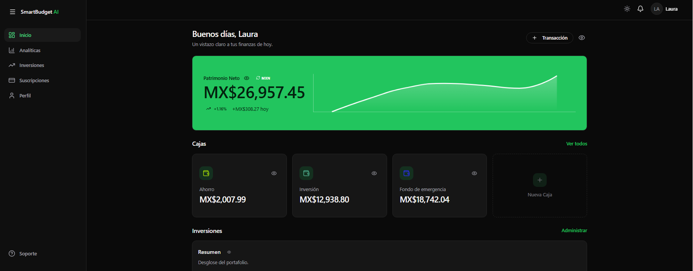
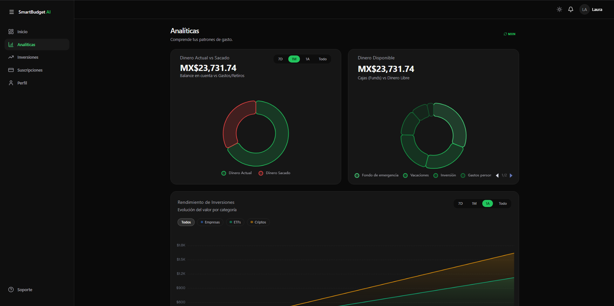
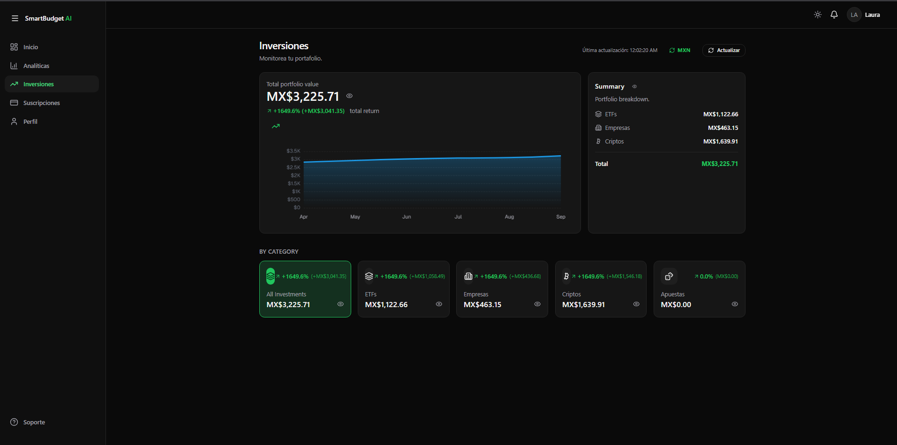
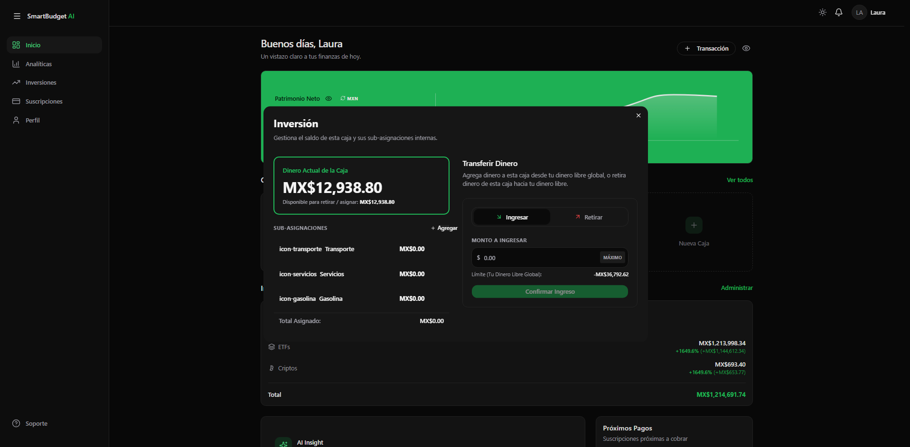
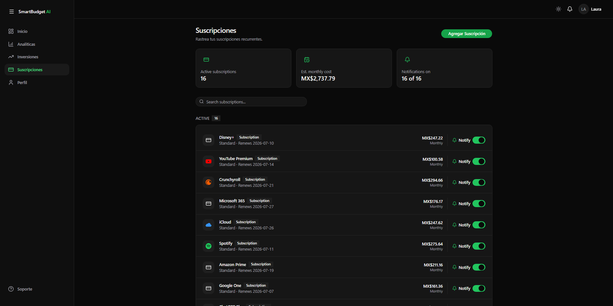
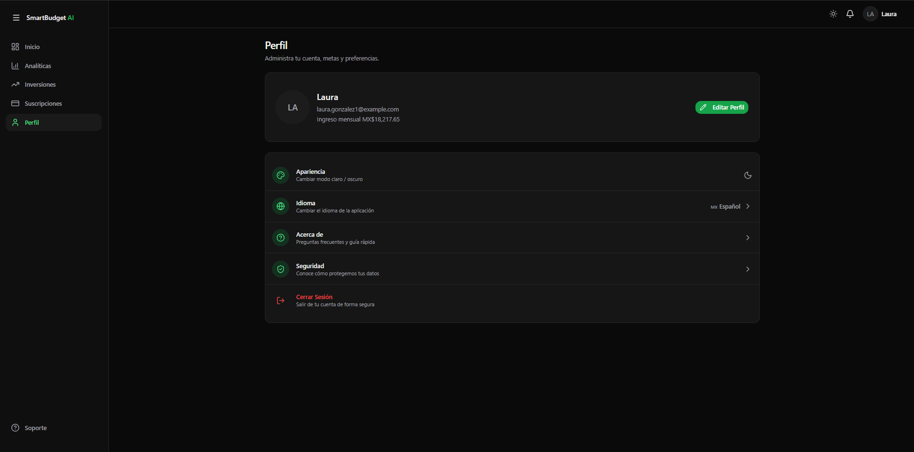
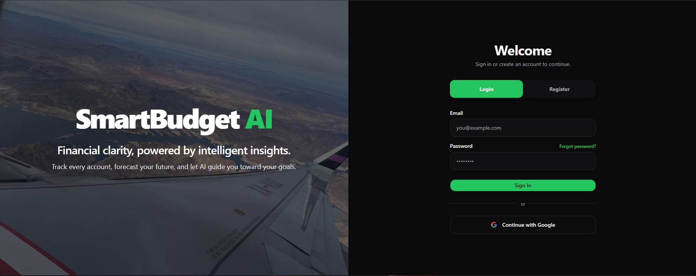

<div align="center">
  
  
  
  **La próxima generación de gestión patrimonial e inteligencia financiera personal.**

  [](https://vuejs.org/)
  [](https://laravel.com/)
  [](https://www.typescriptlang.org/)
  [](https://tailwindcss.com/)
  [](https://www.docker.com/)


</div>

---

## Sobre el Proyecto

**SmartBudget** nace de la necesidad de centralizar, automatizar y proyectar la salud financiera de individuos que manejan múltiples flujos de ingresos e inversiones diversificadas. 

Más allá de ser un simple rastreador de gastos, esta plataforma actúa como un **CFO Personal** que consolida cuentas líquidas, fondos de emergencia, pagos recurrentes (suscripciones) y portafolios de inversión (criptomonedas, bolsa de valores y activos alternativos) en un solo panel de control unificado, ofreciendo métricas en tiempo real de tu Patrimonio Neto (Net Worth).

---

## Características Destacadas

### Gestión de Liquidez y Fondos (Smart Wallets)
- **Cajas Personalizadas:** Clasifica tu liquidez en sub-fondos (Ahorros, Emergencias, Vacaciones).
- **Asignación Granular:** Divide un fondo en presupuestos específicos mediante un sistema de etiquetas y colores intuitivo.
- **Flujo de Caja Real:** Transacciones integradas que actualizan el patrimonio de manera inmediata.

### Hub de Inversiones en Tiempo Real
- **Conectividad Multi-Mercado:** Integración viva con los principales exchanges y agregadores financieros.
- **Portafolio Consolidado:** Rastrea acciones, ETFs, criptomonedas y apuestas deportivas.
- **Análisis de Rendimiento (P&L):** Cálculo de rentabilidad algorítmica ponderada sobre el capital real invertido (ROI/ROE).
- **Gráficos Dinámicos:** Integración nativa con `ECharts` para visualización de tendencias e históricos con suavizado de curvas.

### Analítica y Smart Insights
- **Net Worth Tracker:** Un panorama global y exacto de tus activos menos tus pasivos en cualquier divisa (Soporte Multi-moneda Automático USD/MXN).
- **Tasas de Ahorro e Inteligencia:** Análisis de la relación ingreso/gasto y recomendaciones automáticas de distribución patrimonial.

### Seguridad y UX Premium
- **Autenticación Delegada:** Inicio de sesión *frictionless* usando OAuth 2.0 (Google).
- **Internacionalización Nativa (i18n):** Experiencia fluida tanto en Inglés como en Español.
- **Dark/Light Mode:** Interfaz construida con `shadcn-vue` garantizando accesibilidad y un diseño de vanguardia.

---

## Arquitectura y Tecnologías

El sistema adopta una arquitectura orientada a servicios (SOA) separando la capa de presentación de la lógica de negocio y procesamiento de datos.

### Frontend (SPA)
*   **Core:** `Vue.js 3` (Composition API) + `Vite` + `TypeScript`
*   **Estilos y UI:** `Tailwind CSS`, `shadcn-vue`, `Radix Vue`
*   **Estado e Idioma:** `vue-router`, `vue-i18n`
*   **Visualización de Datos:** `ECharts` (`vue-echarts`)

### Backend (API REST)
*   **Core:** `PHP 8.2` + `Laravel 11`
*   **Base de Datos:** `MySQL 8.0` / `PostgreSQL`
*   **Autenticación:** `Laravel Sanctum` + `Socialite` (JWT/Cookies SPA)

### Integraciones de Datos (Orquestación de APIs)
*   `Binance API` & `CoinGecko` para cotizaciones criptográficas de alta frecuencia.
*   `Finnhub` para telemetría del mercado bursátil tradicional.
*   `OddsAPI` para retornos de capital en apuestas deportivas.
*   `ExchangeRate-API` para coberturas y conversión de divisas en tiempo real.

---

## Capturas de Pantalla

<div align="center">
  
  
  <br><br>
  
  
  <br><br>
  
  
  <br><br>
  
  
</div>

---

## Instalación y Despliegue Local

Sigue estos pasos para desplegar el entorno de desarrollo local.

### Prerrequisitos
- Docker & Docker Compose
- Node.js (v18+)
- Composer / PHP 8.2+ (Si no se usa Sail/Docker)

### Configuración del Backend
```bash
git clone https://github.com/GabrielChaconA/SmartBudget-AI.git
cd SmartBudget-AI/backend

# Copiar configuración
cp .env.example .env

# Instalar dependencias de Laravel
composer install

# Generar llave de aplicación
php artisan key:generate

# Levantar contenedores Docker (Base de datos + App)
./vendor/bin/sail up -d

# Ejecutar migraciones y seeders
./vendor/bin/sail artisan migrate --seed
```

### Configuración del Frontend
```bash
cd ../frontend

# Instalar dependencias
npm install

# Iniciar servidor Vite (HMR)
npm run dev
```

---

## Infraestructura en la Nube (Deployment)
Este proyecto está preparado bajo los principios de *Infrastructure as Code (IaC)* mediante el archivo `render.yaml`. 
El backend corre encapsulado en un contenedor Docker con Nginx y PHP-FPM, mientras que el frontend se distribuye a través de un CDN como un sitio web estático ultra rápido.

> **⚠️ Nota Importante sobre la Demo:** La aplicación está desplegada actualmente utilizando el nivel gratuito (Free Tier) de Render. Debido a esto, la primera vez que intentes acceder (o si la app no ha recibido tráfico en un rato), los servidores pueden tardar **entre 30 y 60 segundos en "despertar"** y cargar completamente. ¡Gracias por tu paciencia!

---

## Autor

**Gabriel Chacón A.**  
Full Stack Developer / Software Engineer

*   **LinkedIn:** [linkedin.com](https://www.linkedin.com/in/gabriel-chac%C3%B3n-arellano-29ab29257/)
*   **GitHub:** [@GabrielChaconA](https://github.com/GabrielChaconA)
*   **Portafolio:** [Gabriel Chacon](https://gabriel-chacon-portfolio.onrender.com/#about)

---

<div align="center">
  <i>Si este proyecto te ha parecido interesante, considera dejar una estrella en el repositorio.</i>
</div>
